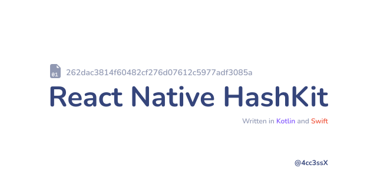

# react-native-hashkit



Mini React Native crypto library written in [kotlin](https://kotlinlang.org/) and [swift](https://www.swift.org/).

## Installation

```sh
npm install react-native-hashkit
```

```sh
yarn add react-native-hashkit
```

## Usage

### SHA-256

```js
import { sha256 } from "react-native-hashkit";

// ...

const result = await sha256('data');
```

### HMAC-SHA256

```js
import { hmacSHA256 } from "react-native-hashkit";

// ...

const result = await hmacSHA256('message', 'secret key');
```

## Roadmap

- [X] MD5
- [X] SHA-1
- [X] SHA-224
- [X] SHA-384
- [X] SHA-256
- [X] SHA-512
- [X] HMAC-SHA256
- [ ] Aes256GCM

## Contributing

See the [contributing guide](CONTRIBUTING.md) to learn how to contribute to the repository and the development workflow.

## License

MIT

---

Made with [create-react-native-library](https://github.com/callstack/react-native-builder-bob)
